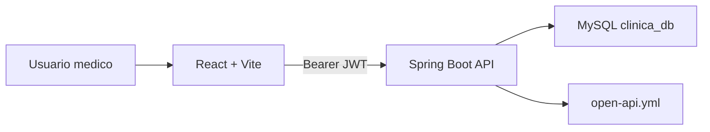

# MedFlow

MedFlow es una aplicacion web para la gestion integral de un consultorio medico. El MVP actual cubre autenticacion, panel de control, pacientes, citas, calendario medico e historia clinica cronologica asociada a cada paciente.

## Tabla de contenido

- [Alcance funcional](#alcance-funcional)
- [Arquitectura](#arquitectura)
- [Tecnologias](#tecnologias)
- [Requisitos](#requisitos)
- [Configuracion local](#configuracion-local)
- [Ejecucion](#ejecucion)
- [Credenciales de prueba](#credenciales-de-prueba)
- [Estructura del proyecto](#estructura-del-proyecto)
- [API y reglas de negocio](#api-y-reglas-de-negocio)
- [Estandares de desarrollo](#estandares-de-desarrollo)
- [Pruebas y validacion](#pruebas-y-validacion)
- [Seguridad y datos clinicos](#seguridad-y-datos-clinicos)
- [Checklist antes de entregar](#checklist-antes-de-entregar)

## Alcance funcional

El sistema permite:

- Iniciar sesion con usuarios registrados y token JWT.
- Visualizar metricas operativas del consultorio.
- Administrar pacientes: crear, editar, eliminar, buscar y exportar.
- Consultar la historia clinica de un paciente desde el panel de pacientes.
- Registrar nuevas notas clinicas asociadas a citas disponibles.
- Gestionar citas medicas y sus estados.
- Visualizar calendario medico unificado con citas y eventos del doctor.
- Consultar documentacion de API mediante `open-api.yml`.

Modulos pendientes o candidatos a fase siguiente:

- Facturacion y pagos.
- Roles mas granulares por perfil.
- Auditoria clinica completa.
- Adjuntos clinicos y resultados de laboratorio.
- Despliegue productivo con variables seguras.

## Arquitectura

MedFlow esta dividido en dos aplicaciones:

- `medflow_frontend`: interfaz web React con Vite.
- `medflow_backend/medflow_backend`: API REST Spring Boot con JWT, JPA y MySQL.

Flujo general:



## Tecnologias

Frontend:

- React 19
- Vite 8
- CSS modular por componente
- ESLint

Backend:

- Java 25
- Spring Boot 4
- Spring Security
- JWT con `jjwt`
- Spring Data JPA
- MySQL
- Maven Wrapper

## Requisitos

Instalar antes de ejecutar:

- Node.js compatible con Vite 8.
- npm.
- Java 25.
- MySQL en local.
- Git.

Base de datos esperada:

- Host: `localhost`
- Puerto: `3306`
- Base: `clinica_db`
- Usuario local por defecto: `root`
- Password local por defecto: `root`

La configuracion esta en:

```text
medflow_backend/medflow_backend/src/main/resources/application.properties
```

## Configuracion local

1. Clonar el repositorio.

```bash
git clone <url-del-repositorio>
cd MedFlow
```

2. Instalar dependencias del frontend.

```bash
cd medflow_frontend
npm install
```

3. Revisar credenciales de MySQL.

Si tu MySQL local no usa `root/root`, ajusta:

```properties
spring.datasource.username=tu_usuario
spring.datasource.password=tu_password
```

4. Configurar secreto JWT para ambientes no locales.

En desarrollo existe un valor por defecto, pero en cualquier entorno compartido debe definirse:

```bash
export JWT_SECRET="un-secreto-largo-y-seguro"
export JWT_EXPIRATION_MS=86400000
```

## Ejecucion

Backend:

```bash
cd medflow_backend/medflow_backend
./mvnw spring-boot:run
```

El backend queda disponible en:

```text
http://localhost:8080
```

Frontend:

```bash
cd medflow_frontend
npm run dev
```

El frontend queda disponible en:

```text
http://localhost:5173
```

Si se necesita apuntar a otra API:

```bash
VITE_API_URL=http://localhost:8080/api/v1 npm run dev
```

Build de produccion:

```bash
cd medflow_frontend
npm run build
```

Preview del build:

```bash
npm run preview
```

## Credenciales de prueba

Los datos semilla incluyen usuarios con la misma contrasena:

```text
Contrasena: Medflow123*
```

Usuarios principales:

```text
admin@medflow.com
doctor.prueba@medflow.com
paciente.prueba@medflow.com
```

Credencial recomendada para validar la experiencia medica:

```text
Correo: doctor.prueba@medflow.com
Contrasena: Medflow123*
```

## Estructura del proyecto

```text
MedFlow/
  medflowDocuments/
    Mockups/
    Utils/
    diagramaClases/
    documentoInforme/
  medflow_frontend/
    src/
      components/
      assets/
    public/
    package.json
    vite.config.js
  medflow_backend/
    medflow_backend/
      src/main/java/com/uam/medflow/
        config/
        controladores/
        dto/
        entidades/
        excepciones/
        repositorios/
        seguridad/
        servicios/
      src/main/resources/
        application.properties
        schema.sql
        data.sql
      open-api.yml
      pom.xml
```

## API y reglas de negocio

La referencia principal de endpoints, schemas y respuestas es:

```text
medflow_backend/medflow_backend/open-api.yml
```

Base URL local:

```text
http://localhost:8080/api/v1
```

Modulos documentados:

- Auth
- Pacientes
- Doctores
- Procedimientos
- Citas
- Historias Clinicas
- Calendario Medico

Reglas relevantes ya implementadas:

- Pacientes no pueden repetir documento ni email.
- Doctores no pueden repetir registro medico ni email.
- Procedimientos no pueden repetir nombre.
- Las citas deben programarse en fecha futura.
- Un doctor no puede tener dos citas a la misma fecha y hora.
- Un paciente no puede tener dos citas a la misma fecha y hora.
- Estados validos de cita: `PROGRAMADA`, `COMPLETADA`, `CANCELADA`.
- Una cita solo puede tener una historia clinica.
- No se permite crear historia clinica para una cita cancelada.
- Al crear una historia clinica, la cita queda marcada como `COMPLETADA`.
- El calendario medico combina citas y eventos.
- Los eventos deben terminar despues de iniciar y no deben cruzarse con citas o eventos activos del doctor.

## Estandares de desarrollo

### Frontend

- Mantener la estetica existente: fondo claro, bordes suaves de 8px, acento azul, tarjetas discretas y densidad adecuada para uso medico.
- Usar componentes funcionales de React y hooks en el nivel superior.
- No crear componentes dentro del render.
- Mantener estados locales simples y predecibles.
- Preferir funciones utilitarias puras para formateo, filtros y transformaciones.
- Mantener textos de interfaz en espanol.
- Cuidar estados vacios, loading, error y fallback.
- Validar responsive en escritorio y movil.
- Ejecutar `npm run lint` y `npm run build` antes de entregar.

### Backend

- Mantener separacion por capas:
  - Controladores: entrada HTTP.
  - Servicios: reglas de negocio.
  - Repositorios: acceso a datos.
  - DTOs: contrato de entrada y salida.
  - Entidades: persistencia JPA.
- Validar requests con Jakarta Validation.
- Centralizar errores en `GlobalExceptionHandler`.
- No exponer entidades directamente desde controladores.
- Mantener OpenAPI actualizado cuando cambien endpoints o reglas.
- Proteger endpoints con JWT salvo rutas publicas de autenticacion.
- Usar transacciones en servicios cuando haya escritura.

### Git

- Commits pequenos y descriptivos.
- No subir artefactos generados: `dist/`, `target/`, logs o metadatos del sistema.
- Revisar `git status` antes de entregar.
- Evitar mezclar cambios funcionales con cambios cosmeticos no relacionados.

## Pruebas y validacion

Frontend:

```bash
cd medflow_frontend
npm run lint
npm run build
```

Backend:

```bash
cd medflow_backend/medflow_backend
./mvnw test
```

Validacion manual recomendada:

1. Iniciar backend y frontend.
2. Iniciar sesion con `doctor.prueba@medflow.com`.
3. Entrar a Pacientes.
4. Buscar un paciente.
5. Abrir la vista de historia clinica con el boton de ver.
6. Revisar linea de tiempo, perfil, alertas y detalle de informe.
7. Abrir Nuevo registro si existe una cita disponible.
8. Validar Citas y Calendario.
9. Revisar consola del navegador.

## Seguridad y datos clinicos

Este proyecto maneja informacion sensible de pacientes. Para un entorno real se deben aplicar como minimo:

- JWT secret fuerte y rotado por ambiente.
- HTTPS obligatorio.
- Variables de entorno para credenciales.
- Politica de CORS restringida por dominio.
- Control de acceso por rol y por propietario del recurso.
- Auditoria de lectura y escritura de historias clinicas.
- Enmascaramiento o minimizacion de datos sensibles en logs.
- Backups cifrados de base de datos.
- Politica clara de retencion de registros clinicos.
- Revision de cumplimiento legal aplicable antes de produccion.

## Checklist antes de entregar

- Backend inicia sin errores.
- Frontend inicia sin errores.
- `npm run lint` pasa.
- `npm run build` pasa.
- `./mvnw test` pasa.
- Login funciona.
- CRUD de pacientes funciona.
- Gestion de citas funciona.
- Calendario carga citas y eventos.
- Historia clinica carga desde el panel de pacientes.
- Nuevo registro clinico respeta validaciones del backend.
- OpenAPI esta actualizado.
- No hay secretos reales versionados.
- No hay archivos `.DS_Store` pendientes de commit.

## Estado actual

El proyecto esta en una fase MVP consolidada para demostracion academica o validacion funcional. La base ya es suficiente para presentar un flujo medico coherente: login, pacientes, citas, calendario e historia clinica conectada.
